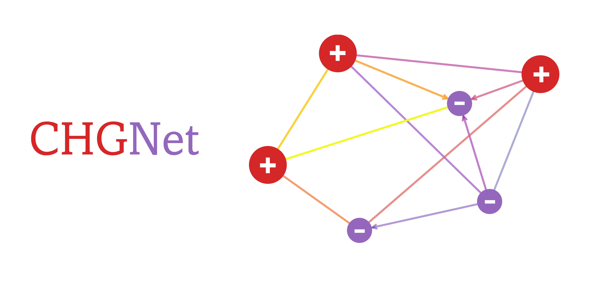

# CHGNet

[](https://github.com/CederGroupHub/chgnet/actions/workflows/test.yml)


A pretrained universal neural network potential for
**charge**-informed atomistic modeling

**C**rystal **H**amiltonian **G**raph neural **Net**work is pretrained on the GGA/GGA+U static and relaxation trajectories from Materials Project, 
a comprehensive dataset consisting of 1.5 Million structures from 146k compounds spanning the whole periodic table.

CHGNet highlights its ability to study electron interactions and charge distribution 
in atomistic modeling with near DFT accuracy. The charge inference is realized by regularizing the atom features with 
DFT magnetic moments, which carry rich information about both local ionic environments and charge distribution.

# Installation:
CHGNet is interfaced to `pymatgen` and `ase`, to install:
- numpy~=1.21.6
- torch~=1.11.0
- pymatgen~=2022.4.19
- ase==3.22.0

To install:
```bash
pip install .
```

# Usage:
## Direct Inference (Static Calculation):
Pretrained `CHGNet` is able to predict the energy (eV/atom), force(eV/A), stress (GPa) 
and magmom (muB) of a given structure.
```python
from chgnet.model.model import CHGNet
from pymatgen.core import Structure

chgnet = CHGNet.load()
structure = Structure.from_file('examples/o-LiMnO2_unit.cif')
prediction = chgnet.predict_structure(structure)
print("CHGNet predicted energy=", prediction['e'])
print("CHGNet predicted magmom=", prediction['m'])
```

## Molecular Dynamics:
Charge-informed molecular dynamics can be simulated with pretrained `CHGNet` through `ASE` environment
```python
from chgnet.model.model import CHGNet
from chgnet.model.dynamics import MolecularDynamics
from pymatgen.core import Structure

structure = Structure.from_file('examples/o-LiMnO2_unit.cif')
chgnet = CHGNet.load()

md = MolecularDynamics(
    atoms=structure,
    model=chgnet,
    ensemble='nvt',
    compressibility_au= 1.6,
    temperature=1000,     # in k
    timestep=2,           # in fs
    trajectory=f'md_out.traj',
    logfile=f'md_out.log',
    loginterval = 100,
    use_device = 'cpu'    # use 'cuda' for faster MD
)
md.run(50) # run a 0.1 ps MD simulation
```
Visualize the magnetic moments after the MD run
```python
from ase.io.trajectory import Trajectory
from pymatgen.io.ase import AseAtomsAdaptor
from chgnet.utils.utils import solve_charge_by_mag
traj = Trajectory("md_out.traj")
mag = traj[-1].get_magnetic_moments()

# get the non-charge-decorated structure
structure = AseAtomsAdaptor.get_structure(traj[-1])
print(structure)

# get the charge-decorated structure
struc_with_chg = solve_charge_by_mag(structure)
print(struc_with_chg)
```
## Structure Optimization
`CHGNet` is able to perform fast structure optimization and 
provide the site-wise magnetic moments. This make it ideal for pre-relaxation and
`MAGMOM` initialization in spin-polarized DFT.
```python
from chgnet.model import StructOptimizer
relaxer = StructOptimizer()
result = relaxer.relax(structure)
print('CHGNet relaxed structure', result['final_structure'])
```


## Model Training / Fine-tune:
Fine-tuning will help achieve better accuracy if high-precision study
is desired. To train/tune a `CHGNet`, you need to define your data in a
pytorch `Dataset` object. The example datasets are provided in `data/dataset.py`

```python
from chgnet.data.dataset import StructureData, get_train_val_test_loader
from chgnet.trainer import Trainer

dataset = StructureData(
    structures=list_of_structures,
    energies=list_of_energies,
    forces=list_of_forces,
    stresses=list_of_stresses,
    magmoms=list_of_magmoms
)
train_loader, val_loader, test_loader = get_train_val_test_loader(
    dataset,
    batch_size=32,
    train_ratio=0.9,
    val_ratio=0.05
)
trainer = Trainer(
    model=chgnet,
    targets='efsm',
    optimizer='Adam',
    criterion='MSE',
    learning_rate=1e-2,
    epochs=50,
    use_device='cuda'
)

trainer.train(train_loader, val_loader, test_loader)
```
#### Note: 
1. The energy used for training should be energy/atom if you're fine-tuning the pretrained `CHGNet`
2. `CHGNet` stress is in unit GPa, and the unit conversion has already been included in 
`data/dataset.py`. So `VASP` stress can be directly fed to `StructureData`
3. To save time from graph conversion step for each training, we recommend you use `GraphData` defined in
`data/dataset.py`, which reads graph directly from saved directory. To create a saved graphs, 
see `examples/make_graphs.py`.
4. Apple’s Metal Performance Shaders `MPS` is currently disabled before stable version of `pytorch` for
`MPS` is released.
# Reference:
link to our paper:
https://doi.org/10.48550/arXiv.2302.14231

Please cite the following:
```text
@article{deng2023chgnet,
title={CHGNet: Pretrained universal neural network potential for charge-informed atomistic modeling}, 
author={Bowen Deng and Peichen Zhong and KyuJung Jun and Kevin Han and Christopher J. Bartel and Gerbrand Ceder},
year={2023},
eprint={2302.14231},
archivePrefix={arXiv},
primaryClass={cond-mat.mtrl-sci}
}
```

# Development & Bugs
`CHGNet` is under active development, if you encounter any bugs in installation and usage, 
please start an [issue](https://github.com/CederGroupHub/chgnet/issues). We appreciate your contribute!

