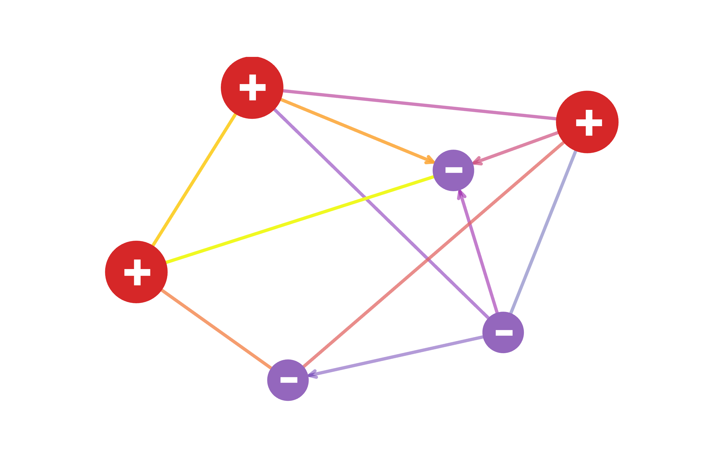

# CHGNet
Crystal Hamiltonian Graph neural-Network: A pretrained universal neural network potential for 
charge-informed molecular dynamics and beyond

# Installation:
CHGNet requires
- numpy~=1.21.6
- torch~=1.11.0
- pymatgen~=2022.4.19
- ase==3.22.0

To install:
```bash
pip install .
```

# Usage:
## Direct Inference (Static Calculation):
```python
from chgnet.model.model import CHGNet
from pymatgen.core import Structure

chgnet = CHGNet.load()
structure = Structure.from_file('examples/o-LiMnO2_unit.cif')
prediction = chgnet.predict_structure(structure)
```

## Molecular Dynamics:
Charge-informed molecular dynamics can be simulated with pretrained `CHGNet` through ASE environment
```python
from chgnet.model.model import CHGNet
from chgnet.model.dynamics import MolecularDynamics
from pymatgen.core import Structure

structure = Structure.from_file('examples/o-LiMnO2_unit.cif')
chgnet = CHGNet.load()

md = MolecularDynamics(
    atoms=structure,
    model=chgnet,
    ensemble='nvt',
    compressibility_au= 1.6,
    temperature=1000,     # in k
    timestep=2,           # in fs
    trajectory=f'md_out.traj',
    logfile=f'md_out.log',
    loginterval = 100,
    use_device = 'cuda'
)
md.run(500000) # run a 1 ns MD simulation
```
Visualize the magnetic moments after the MD run
```python
from ase.io.trajectory import Trajectory
traj = Trajectory("md_out.traj")
mag = traj[100].get_magnetic_moments()

# convert to pymatgen structure
from pymatgen.io.ase import AseAtomsAdaptor
structure = AseAtomsAdaptor.get_structure(traj[100])
```
## Structure Optimization
```python
from chgnet.model import StructOptimizer
relaxer = StructOptimizer()
result = relaxer.relax(structure, steps=1000)
```


## Model Training / Fine-tune:
Fine-tuning will help achieve better accuracy if high-precision study
is desired. To train/tune a `CHGNet`, you need to define your data in a
pytorch `Dataset` object. The example datasets are provided in `data/dataset.py`
```python
from chgnet.data.dataset import StructureData, get_train_val_test_loader
from chgnet.trainer import Trainer

dataset = StructureData(
    structures=list_of_structures,
    energies=list_of_energies,
    forces=list_of_forces,
    stresses=list_of_stresses,
    magmoms=list_of_magmoms
)
train_loader, val_loader, test_loader = get_train_val_test_loader(
    dataset,
    batch_size=32,
    train_ratio=0.9,
    val_ratio=0.05
)
trainer = Trainer(
    model=chgnet,
    targets='efsm',
    optimizer='Adam',
    criterion='MSE',
    learning_rate=1e-2,
    epochs=50,
    use_device='cuda'
)

trainer.train(train_loader, val_loader, test_loader)
```
